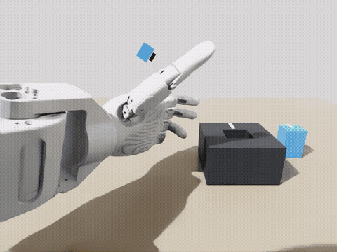

# qiling_xvla

S4 右臂 + O6 夹爪在 Isaac Sim 中做 **细长销插入（slender-pin insertion）** 的 XVLA 全链路：Auto-IK 专家采集、转 LeRobot v3、训练、闭环 rollout。

Isaac Sim 负责场景、相机、物理与 IK；XVLA 在独立的 LeRobot 进程里推理，通过 stdio pickle 与仿真交换观测/动作。**不要手动启动** `serve_xvla_policy.py`，rollout 脚本会自己拉起。

Python 包名是 `qiling_xvla`（目录 `src/qiling_xvla/`），和 GitHub 仓库名一致。部分脚本文件名仍带 `rj45` / `handle_pin`，是从共用 Isaac 场景复用下来的，当前任务是细长销。

按下面顺序做即可跑通：**装环境 → 生成采集计划 → GUI/无头 Auto-IK 录制 → 校验 → 转 LeRobot → 训练 → rollout**。

闭环 rollout 示例（200k ckpt，`--seed 40`）：

<p align="center">
  
</p>

---

## 1. 目录结构

下面只列 **会 push 进 git** 的内容。`datasets/`、`outputs/`、`models/` 以及 π0.5 / RJ45 专用脚本在 `.gitignore` 里，clone 下来没有。

```text
.
├── README.md
├── .gitignore
├── assets/
│   └── slender_pin_xvla_rollout_seed40.gif   # README 示例动图（200k ckpt，seed 40）
│
├── configs/
│   ├── task_slender_pin_insertion_right_arm.yaml  # 销/槽几何、摩擦、Auto-IK 相位、验收阈值
│   ├── robot_dual_arm.yaml                        # S4 双臂 + O6 关节、home、URDF 路径
│   └── camera_bimanual.yaml                       # chest / 左右腕外参与分辨率
│
├── scripts/                                       # 细长销 XVLA 全链路
│   ├── generate_slender_pin_recovery_smoke.py     # 生成 raw 采集计划（seed / recovery）
│   ├── run_slender_pin_autoik_gui.py              # GUI 采集入口（补全插入参数后转调下面那个）
│   ├── run_handle_pin_grasp_gui.py                # 实际 Auto-IK 采集（文件名是历史遗留）
│   ├── record_slender_pin_recovery_smoke_headless.py  # 按 manifest 无GUI大批量录制
│   ├── validate_slender_pin_recovery_dataset.py   # 校验 recorded episode（维度 / 视频 / PASS）
│   ├── convert_slender_pin_to_lerobot_v3.py       # recorded → LeRobot v3 训练集
│   ├── convert_fixed_socket_rj45_to_lerobot_v3_common.py  # 转换公共实现，上面脚本调用它
│   ├── serve_xvla_policy.py                       # XVLA 推理进程；由 rollout 拉起，不要手开
│   ├── run_slender_pin_xvla_rollout.py            # 单局闭环 rollout（可 GUI / 录像）
│   ├── batch_slender_pin_xvla_headless.py         # 无 GUI 批量评测不同销位
│   ├── run_rj45_isaac_handoff_scene.py            # 共用：Isaac 建场景、物理、相机、URDF 导入
│   └── run_rj45_fixed_socket_scene.py             # 共用：左臂观测位姿、手部 preset（采集会 import）
│
├── src/qiling_xvla/                               # Python 包（脚本把 src/ 加进 sys.path）
│   ├── __init__.py
│   ├── control/
│   │   ├── dual_arm_pinocchio.py                  # 双臂 Pinocchio IK（采集和 rollout 都用）
│   │   ├── posture_safe_ik.py                     # 带姿态约束的 IK
│   │   └── right_arm_pinocchio.py                 # Pinocchio 导入规避 ROS 路径；被 dual_arm 调用
│   └── data/
│       ├── slender_pin_episode_recorder.py        # 细长销 17D/10D 录制器
│       ├── fixed_socket_episode_recorder.py       # 视频写入、rot6d；细长销 recorder 复用
│       └── rj45_insertion_plan.py                 # 细长销主流程用不到（handoff 里 RJ45 回放才会 import）
│
├── isaac_sim_slender_pin_v1/
│   ├── slender_pin.usda                           # 细长销网格 / 质量 / 白色方向线
│   └── fixed_slender_socket.usda                  # 固定插座；通道 31×35 mm
│
└── robot_description/                             # S4 + O6 描述（Isaac 按 URDF 导入）
    ├── CMakeLists.txt / package.xml               # 细长销流程用不到（ROS2 包装遗留）
    └── S4/
        ├── urdf/
        │   ├── S4_38dof_with_palm.urdf            # 实际导入 / IK 用的 URDF
        │   ├── S4_38dof.urdf                      # yaml 里有路径，当前脚本不用
        │   └── s4_dual_arm.urdf                   # yaml 里有路径，当前脚本不用
        ├── mjcf/                                  # 细长销流程用不到（相机 yaml 只当外参出处备注）
        └── meshes/
            ├── *.STL / base_link.obj              # 躯干、腿、臂；URDF 引用
            ├── o6/left|right/meshes/*.STL         # O6 夹爪；URDF 引用
            ├── bowl/ duck/ mug/ waterbottle/      # 细长销流程用不到
            └── rj45/*.stl                         # 细长销流程用不到（RJ45 任务本机脚本才用）
```

本机若还有 `scripts/run_rj45_*pi05*`、`configs/task_rj45_fixed_socket_right_arm.yaml` 等，已被 `.gitignore`，不会进仓库。

---

## 2. 安装依赖

必须 **两个 conda 环境**。Isaac Sim 自带一套 Python/OpenGL；LeRobot 要较新的 PyTorch。装在同一个环境里几乎一定会冲突。

以下命令在仓库根目录执行。环境名用 `qiling_isaac` / `qiling_xvla`，可改，后面命令一起改即可。

### 2.1 系统软件

```bash
sudo apt update
sudo apt install -y git ffmpeg build-essential cmake
```

NVIDIA 驱动需能跑 Isaac Sim 5.0（一般 535+）。训练/推理的 CUDA 与下面 PyTorch 索引一致即可（本仓库用 CUDA 12.8）。

```bash
nvidia-smi
```

### 2.2 仿真环境 `qiling_isaac`

使用 **Isaac Sim 5.0 官方 Linux 独立安装包**（不要 `pip install isaacsim==4.5`）。5.1 安装步骤相同。

1. 从 [Isaac Sim 下载页](https://docs.isaacsim.omniverse.nvidia.com/5.0.0/installation/download.html) 取 Linux zip，解压：

```bash
mkdir -p "$HOME/software"
# 把下载的 zip 换成你的文件名
unzip isaac-sim-standalone-5.0.0-linux-x86_64.zip -d "$HOME/software/isaac-sim-5.0.0"
export ISAAC_SIM_PATH="$HOME/software/isaac-sim-5.0.0"
```

2. 建 conda 环境，激活时 source Isaac 的 `setup_conda_env.sh`：

```bash
conda create -n qiling_isaac python=3.11 -y
conda activate qiling_isaac

mkdir -p "$CONDA_PREFIX/etc/conda/activate.d"
cat > "$CONDA_PREFIX/etc/conda/activate.d/isaacsim.sh" << EOF
source ${ISAAC_SIM_PATH}/setup_conda_env.sh
EOF

conda deactivate
conda activate qiling_isaac
```

3. 只补本仓库仿真侧还要用的包（IK + yaml + 校验视频）：

```bash
pip install pin pyyaml numpy opencv-python-headless
```

不要往这个环境里装 LeRobot / 完整 PyTorch 训练栈。

检查：

```bash
conda activate qiling_isaac
python -c "from isaacsim import SimulationApp; import pinocchio; print('isaac+pinocchio ok')"
ffmpeg -version | head -1
```

第一次起 Isaac 会写本地缓存，需要联网。

### 2.3 策略环境 `qiling_xvla`

LeRobot **0.5.0**，并且 **只装 XVLA extra**。不要 `pip install lerobot`，也不要 `pip install -e ".[all]"`：前者是整包默认依赖、且不一定带 XVLA；后者会把 pi / groot / smolvla / 电机 SDK / 仿真环境等全部 extra 拉进来。

`.[xvla]` 只会在核心 LeRobot 之上加 `transformers`（XVLA 需要）。checkout 里会有其他 policy 源码文件，但不会安装它们的依赖。

```bash
conda create -n qiling_xvla python=3.12 -y
conda activate qiling_xvla

pip install torch torchvision --index-url https://download.pytorch.org/whl/cu128

git clone --branch v0.5.0 https://github.com/huggingface/lerobot.git "$HOME/code/lerobot-v0.5.0"
cd "$HOME/code/lerobot-v0.5.0"
pip install -e ".[xvla]"
```

检查：

```bash
conda activate qiling_xvla
python -c "from lerobot.policies.xvla.modeling_xvla import XVLAPolicy; print('xvla ok')"
```

把策略解释器路径固定下来（rollout 会读这个变量）：

```bash
export XVLA_POLICY_PYTHON="$HOME/miniconda3/envs/qiling_xvla/bin/python"
```

可写进 `~/.bashrc`。未设置时，脚本会尝试 `$HOME/miniconda3/envs/qiling_xvla/bin/python`。

### 2.4 克隆本仓库

```bash
git clone git@github-qirobotics:qi-robotics/qiling_xvla.git
cd qiling_xvla
```

SSH 需能访问 `qi-robotics` 组织。若本机用了 ssh Host 别名，把 remote 写成 `git@github-qirobotics:qi-robotics/qiling_xvla.git`。

---

## 3. 采集：计划（raw）和录制（recorded）

两套目录都要有，职责不同：

| 目录 | 里面是什么 | 怎么来的 |
|---|---|---|
| `datasets/raw_slender_pin_v1/` | **采集计划**：`manifest.json` + 每局一个只有 `seed` / `recovery_type` 的 `metadata.json`（`status=PLANNED`）。没有视频、没有关节轨迹 | `python scripts/generate_slender_pin_recovery_smoke.py` |
| `datasets/recorded_slender_pin_v1/` | **真正录下来的专家数据**：`episode.npz` + 三相机 mp4 + 录制后的 `metadata.json`（`status=PASS/FAIL`） | 按 raw 计划跑 Auto-IK：GUI 或 `record_slender_pin_recovery_smoke_headless.py` |

Auto-IK **不会事先写出一份关节/位姿轨迹文件**。轨迹在 **开仿真录制的那一刻** 才算：脚本读 `configs/task_slender_pin_insertion_right_arm.yaml` 里的 `expert_auto_ik`（抓、抬、对准、插入、松手、回 home），用 Pinocchio 当场解 IK，边跑边写入 `recorded/...`。改 yaml 即改专家行为。

本机现有数据：`generate_... --count 650` 得到 raw（650 条计划），再 headless 录进 recorded（同样 650 个 episode 目录；其中一部分 FAIL，转 LeRobot 时会丢掉）。

`--episode-seed` / `--seed` 会在销默认 XY 附近随机约 ±10 mm。`--recovery-type` 可在孔口注入横向或角度扰动再纠正。

### 3.1 GUI 预览（不存盘）

确认场景和插入是否正常：

```bash
conda activate qiling_isaac
cd /path/to/qiling_xvla
python scripts/run_slender_pin_autoik_gui.py
```

这会打开 Isaac 窗口，右臂自动完成一次完整插入。只看抓取/抬起、不插入时：

```bash
python scripts/run_handle_pin_grasp_gui.py
```

### 3.2 GUI 录制一局

```bash
conda activate qiling_isaac
mkdir -p datasets/recorded_slender_pin_v1/episode_000000
python scripts/run_slender_pin_autoik_gui.py \
  --episode-seed 0 \
  --recovery-type normal \
  --record-out-dir datasets/recorded_slender_pin_v1/episode_000000
```

成功后该目录应有：

- `metadata.json`（`status=PASS` 且 `task_success=true`）
- `episode.npz`（17D state、10D action、20 Hz）
- `videos/chest.mp4`、`left_wrist.mp4`、`right_wrist.mp4`

`--record-out-dir` 必须是空目录。换 seed 则换目录名，例如 `episode_000001`。

### 3.3 无GUI大批量录制

先写计划（至少 3 条；约 70% `normal`，其余为 `lateral_offset` / `angular_offset`）：

```bash
conda activate qiling_isaac
python scripts/generate_slender_pin_recovery_smoke.py \
  --output-root datasets/raw_slender_pin_v1 \
  --count 300 \
  --seed 20260814
```

会得到 `datasets/raw_slender_pin_v1/manifest.json`。再无 GUI 按 manifest 录：

```bash
python scripts/record_slender_pin_recovery_smoke_headless.py \
  --raw-root datasets/raw_slender_pin_v1 \
  --recorded-root datasets/recorded_slender_pin_v1 \
  --resume
```

`--resume` 会跳过已经完整的 episode。中断后同样命令可续录。

只录某一局：

```bash
python scripts/record_slender_pin_recovery_smoke_headless.py \
  --episode episode_000000 \
  --resume
```

### 3.4 校验

```bash
python scripts/validate_slender_pin_recovery_dataset.py \
  --recorded-root datasets/recorded_slender_pin_v1 \
  --json-out reports/slender_pin_v1_validation.json
```

只转换 `status=PASS` 且 `task_success=true` 的 episode。失败的会在转 LeRobot 时被跳过。

---

## 4. 转成 LeRobot v3 再训练

转换在 **`qiling_xvla`** 里跑（需要 `lerobot` + OpenCV）：

```bash
conda activate qiling_xvla
cd /path/to/qiling_xvla
python scripts/convert_slender_pin_to_lerobot_v3.py \
  --recorded-root datasets/recorded_slender_pin_v1 \
  --output-dir datasets/slender_pin_lerobot_v3_xvla_v1 \
  --repo-id qiling/slender_pin_xvla_v1 \
  --overwrite
```

输出是 LeRobot v3：

| 字段 | 内容 |
|---|---|
| `observation.images.chest/left_wrist/right_wrist` | 480×640 RGB，20 fps |
| `observation.state` | 17D：EEF xyz + rot6d + 7 臂关节 + grasp |
| `action` | 10D：绝对 EEF xyz + rot6d + grasp |

本机若已有历史目录 `datasets/slender_pin_lerobot_v3_pi05_v1`，名字里的 `pi05` 只是旧命名，**给 XVLA 用的**，可直接拿来训练/rollout，不必重转。

---

## 5. 训练 XVLA

```bash
conda activate qiling_xvla
cd /path/to/qiling_xvla

lerobot-train \
  --policy.type=xvla \
  --dataset.root=datasets/slender_pin_lerobot_v3_xvla_v1 \
  --dataset.repo_id=qiling/slender_pin_xvla_v1 \
  --batch_size=4 \
  --steps=200000 \
  --save_freq=50000 \
  --output_dir=outputs/xvla_slender_pin_full
```

从已有 ckpt 接着训时加上，例如：

```text
--policy.pretrained_path=outputs/xvla_slender_pin_full/checkpoints/last/pretrained_model
```

参考超参：lr `2.5e-5`，chunk 32，bfloat16，三相机，action 用 `MEAN_STD` 反归一化。权重大，不要提交到 git。

---

## 6. Rollout

始终在 **`qiling_isaac`** 里起仿真；策略进程用 `XVLA_POLICY_PYTHON`。

### 6.1 单局（可开 GUI、可录像）

```bash
conda activate qiling_isaac
export XVLA_POLICY_PYTHON="$HOME/miniconda3/envs/qiling_xvla/bin/python"
cd /path/to/qiling_xvla

python scripts/run_slender_pin_xvla_rollout.py \
  --checkpoint outputs/xvla_slender_pin_full/checkpoints/last/pretrained_model \
  --dataset datasets/slender_pin_lerobot_v3_xvla_v1 \
  --policy-device cuda \
  --execution-horizon 32 \
  --seed 200 \
  --record-video \
  --out-dir outputs/slender_pin_xvla_rollout/seed200
```

`--out-dir` 必须为空。`--headless` 关窗口。`--execution-horizon 32` 表示跑完一个 XVLA chunk 再重新观测。

成功 = 销进入插座（`ever_inserted` / `success`），卡住也算成功。

### 6.2 无 GUI 批量评测不同销位

不开窗口，按 `--seed-start` 到 `--seed-end` 依次换销的初始 XY，统计插入成功率：

```bash
conda activate qiling_isaac
export XVLA_POLICY_PYTHON="$HOME/miniconda3/envs/qiling_xvla/bin/python"

python scripts/batch_slender_pin_xvla_headless.py \
  --checkpoint outputs/xvla_slender_pin_full/checkpoints/last/pretrained_model \
  --dataset datasets/slender_pin_lerobot_v3_xvla_v1 \
  --policy-device cuda \
  --execution-horizon 32 \
  --seed-start 200 \
  --seed-end 300 \
  --summary-path outputs/slender_pin_xvla_rollout/batch_seed200_300_summary.json
```

看同目录的 `.json` / `.txt` 里的成功率和成功 seed。默认不录像。

---

## 7. 数据流

```text
yaml expert_auto_ik
        │
        ▼
 generate_*.py  →  raw/.../manifest.json
        │
        ▼
 Auto-IK GUI 或 headless record
        │
        ▼
 recorded/.../episode_*/  (npz + 三相机 mp4)
        │
        ▼
 convert_slender_pin_to_lerobot_v3.py   （qiling_xvla）
        │
        ▼
 LeRobot v3 dataset  →  lerobot-train  →  checkpoint
        │
        ▼
 Isaac rollout  ←IPC→  serve_xvla_policy.py
```

观测与动作：RGB 480×640 × 3；state 17D；action 10D 绝对位姿。策略不看销/孔的真值位姿。

---

## License

内部项目，未指定开源协议。
